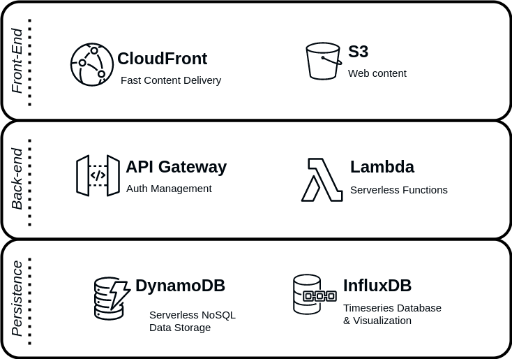
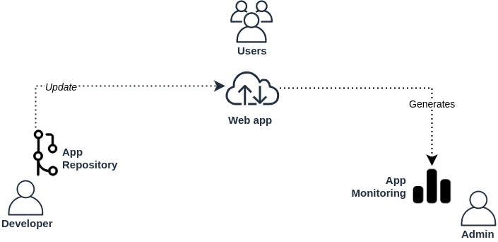
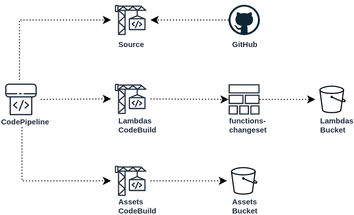
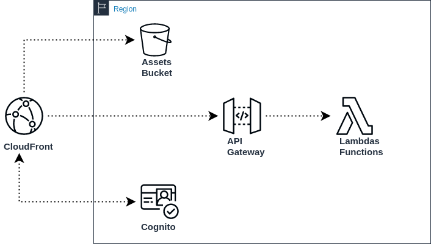
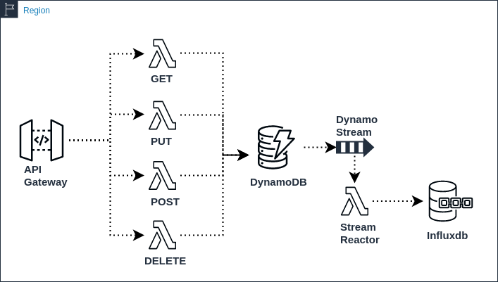
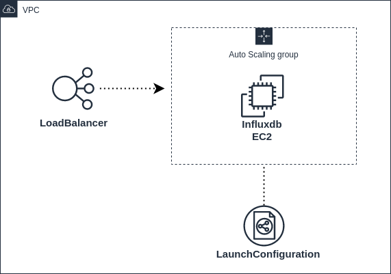
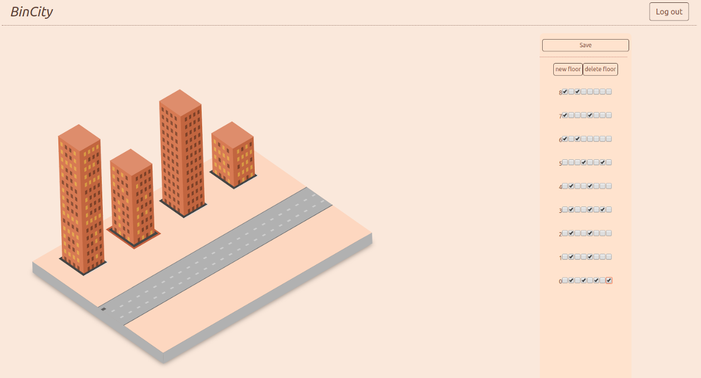
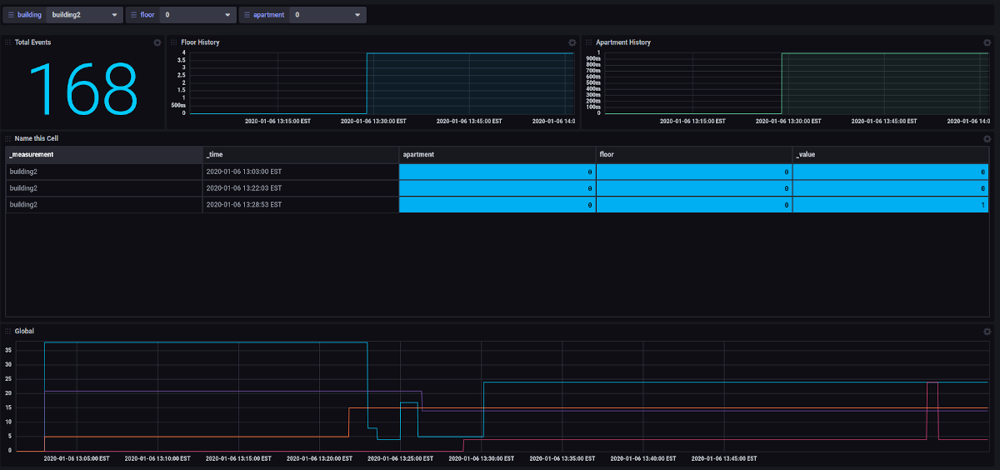

# BinCity AWS Stack Template

BinCity AWS Stack Template is a CloudFormation definition for the creation of a simple infrastructural solution in Amazon Web Services for the rapid hosting of web applications, based on high availability and distribution, integrated authentication mechanisms, persistence, monitoring, and all the elasticity of the cloud. 

Also, a sample web application (BinCity) is provided with the intent of demonstrating the capabilities of the stack.

**Important Note**: Creating this AWS Stack will create and consume AWS resources which will **cost money**, please review the list of resources that the stack will create and consult the [AWS Pricing](https://aws.amazon.com/pricing/) for an estimation of the cost of running this stack on your region.

&nbsp;

---

&nbsp;

<a name="content"></a>
## Content

- [BinCity AWS Stack Template](#bincity-aws-stack-template)
  - [Content](#content)
  - [Overview](#overview)
  - [Architecture](#architecture)
    - [Roles View](#roles-view)
    - [Delivery Pipeline](#delivery-pipeline)
    - [Front-end View](#front-end-view)
    - [Back-end View](#back-end-view)
    - [Influxdb Stack View](#influxdb-stack-view)
  - [About the Demo Application](#about-the-demo-application)
    - [ListApartments](#listapartments)
    - [CreateApartments](#createapartments)
    - [UpdateApartments](#updateapartments)
    - [DeleteApartments](#deleteapartments)
    - [StreamReactor](#streamreactor)
  - [Deploying](#deploying)
    - [Parameters](#parameters)
    - [Resources](#resources)
    - [Roles / Policies / Profiles](#roles--policies--profiles)
  - [Considerations / Limitations](#considerations--limitations)
  - [Disclaimer](#disclaimer)
  - [Questions or contact](#questions-or-contact)
  - [License](#license)

&nbsp;

---

&nbsp;

<a name="overview"></a>
## Overview

&nbsp;

The stack is formed around the classical three-tier model, therefore defining the presentation, business, and data layers for the operation of the web application.

&nbsp;


<a name="stack-summary"></a>


&nbsp;

At the front-end (presentation) layer, CloudFront is set for the distribution of the content and caching of the static web assets, making them available in its global network.

The web assets are stored in an S3 bucket with permissions set to only be accessible from the CloudFront distribution.

For the authentication and access to the application, Cognito is used with its corresponding user pool and configured for sign-up and sign-in, which can be extended for use with social identity providers.

At the service (business) layer, and API Gateway is created to serve as the front door for the RESTFul serverless functions which perform the functionality of the application and communication with the data stores.

For the data (persistence) layer, two different types of databases are deployed, DynamoDB serves as the first level of data persistence, in which in the implementation here provided, is used to store the current state of the system.

A second database is provided, Influxdb, for the storage of historical data, which is updated with the changes of state of the system through time.


---

&nbsp;

<a name="architecture"></a>
## Architecture

&nbsp;

In the next section, a description of the architecture is presented to better understand the different components and services that the stack will deploy, starting with a view of the different roles that participate in the architecture, the mechanism for deploying the system, the model of the back-end, and the model for the persistence and monitoring.

&nbsp;

--- 

&nbsp;

### Roles View

The stack takes into account three different roles; The users, the developer, and the administration.

&nbsp;

<a name="roles-summary"></a>


&nbsp;

The idea of the stack is to make simple the operation, maintenance, and continuity of the application been served, for that reason, a simple delivery mechanism is integrated so the development of the application can be continuously integrated into the stack.

Also, an extension to the already available AWS services (like CloudWatch) are deployed to provide business analytics in near-realtime, that is, a time-series database is made available for the application.

In the following sections, a functional break-down of the different perspectives for the roles is presented.

&nbsp;

---

&nbsp;

### Delivery Pipeline

&nbsp;

The stack creates the necessary services for the automated delivery of updates to the application components, this is pulled from a GitHub repository, in which a branch is configured to be monitored for changes and deployed into the corresponding S3 buckets.

&nbsp;

<a name="pipeline-summary"></a>


&nbsp;

The CodePipeline service is responsible for orchestrating the three CodeBuild projects and passing the artifacts pulled from the code repository, these artifacts are stored in a third S3 bucket (please visit the full list of components deployed for a description of all components and permissions).

The Lambdas CodeBuild is responsible for creating a CloudFormation Changeset that will deploy or update the Stack for the lambda functions, which in turn, will create the API Gateway for the interaction with the lambdas, and store the lambdas in its corresponding S3 bucket.

All the resources necessary for the packaging of the different components of the application are contained in the code repository, for the Lambdas Stack, the CloudFormation definition can be found in the functions/ directory.

It's important to consider, that the stack can be extended to create different deployment environments (staging, UAT, production, etc..) considering there are extra costs for such.

&nbsp;

----

&nbsp;

### Front-end View

&nbsp;


The web application is made available through a CloudFront deployment which contains all permissions for the interaction with the front-end and back-end.

&nbsp;

<a name="web-summary"></a>


&nbsp;

Cognito is made available for authentication provisioning and inter-connected with the API Gateway for authorization of access to the resources. Also available and configured, are the mechanisms for new user registration confirmation.


At the stack creation, an e-mail address must be provided which will be used as the administrative user.


&nbsp;

---

&nbsp;

### Back-end View

&nbsp;

The back-end is conformed of mostly serverless services that can be requested through the API Gateway, these are the necessary lambda functions which perform the business logic and persistence of the data.

&nbsp;

<a name="backend-summary"></a>


&nbsp;

The API Gateway is configured to utilize authorized tokens from Cognito to fulfill the requests, only registered and authenticated tokens will be accepted.

Herefore, two types of Lambdas are provided, those performing the work of the business logic and managing the persistence, and those that react for changes to the DynamoDB Stream. In this case, the Stream Reactor will read batches of newly modified or created items, transform them and send the data to Influxdb.

The business logic lambdas retrieve the code for the functions from their respective buckets which are delivered from the CodeBuild project in the CodePipeline.

&nbsp;

---

&nbsp;

<a name="influx-summary"></a>
### Influxdb Stack View

&nbsp;

The Influxdb instance runs in an EC2, which in the stack is defined as an AutoScalingGroup and accessible through a LoadBalancer.

&nbsp;



&nbsp;

When deploying the stack, a VPC, Subnet, and an EC2 Keypair must be provided which will be used for the configuration of the LoadBalancer and the AutoScalingGroup.

Also, a temporary password for the administrator account of the Influxdb will be asked, this can be used for an initial sign-in unto the Influxdb UI with the username admin, **just remember to change it**.

This instance can be modified to be within private subnet boundaries and inaccessible from the public internet, this will require some modifications to the Stream Reactor configuration for it to reach the private instance.

&nbsp;

---

&nbsp;

<a name="demoapp"></a>
## About the Demo Application

&nbsp;

The Demo Web Application (BinCity v0.1) represents an abstraction of a global binary state (On/Off) for a set of objects, In the application, this state is represented as apartments within a building.

&nbsp;



&nbsp;

The application is an abstraction to different applications:

- Clickstream
- Global Representational State
- Massive Session Management / Monitoring
- Internet of Things
- More ...

The application makes use of the Cognito provided by the stack to authorize and sign the user. An authorized user can make changes to the global state.

The application uses a table in DynamoDB to store the current global state and uses the Influxdb for historical changes to the state.


The application has been developed using React and makes use of Redux, and AWS Amplify for its operability. Other libraries and frameworks utilized:

- react-redux
- aws-amplify
- react-bootstrap
- react-router
- react-thunk
- UUID


The application utilizes the API Gateway as its RESTFul backend to fulfill its requests, there are five lambda functions provided to serve as the backend for the application. The lambda functions provided:

### ListApartments

Lambda function that retrieves the lists all the apartments registered in the system.

``` 
  GET /apartments

  response: {
    [{
      key: 'UUID v4'
      apartment: 0,
      building: 0,
      floor: 0,
      building: 0,
      value: 1
    }],
    ...
  }

```


### CreateApartments

Lambda function that creates a set of apartments for a floor (8 apartments per floor), assigns an UUIDv4 as key, saves it in the database, then returns the newly created apartments

``` 
  POST /apartments

  request: {          
      building: 0          
  }

  response: {
    [{
      key: 'UUID v4'
      apartment: 0,
      building: 0,
      floor: 0,
      building: 0,
      value: 1
    }],
    ...
  }

```

### UpdateApartments

Lambda function that updates a batch of apartments, if the apartments do not contain a key, then the function will assign a UUID v4 and save it in the database.

``` 
  PUT /apartments

  request: {
    [{
      key: 'UUID v4'
      apartment: 0,
      building: 0,
      floor: 0,
      building: 0,
      value: 1
    }],
    ...
  }

  response: {
    [{
      key: 'UUID v4'
      apartment: 0,
      building: 0,
      floor: 0,
      building: 0,
      value: 1
    }],
    ...
  }

```

### DeleteApartments

Lambda function that deletes a set of apartments from the database.

``` 
  DELETE /apartments

  request: {
    [{
      key: 'UUID v4'
      apartment: 0,
      building: 0,
      floor: 0,
      building: 0,
      value: 1
    }],
    ...
  }

  response: {    
      deleted: 8    
  }

```

&nbsp;

### StreamReactor

This lambda function will react to the DynamoDB Stream for new modifications of the current state, then send a request to the Influxdb API to store the modification.

An example dashboard is provided to demonstrate how this data can be exploited using the features of Influxdb 2.0 (please note this just a demonstration purpose, therefore some limitations apply).

&nbsp;



---

&nbsp;

<a name="deploying"></a>
## Deploying

&nbsp;

Creating this AWS Stack will create and consume AWS resources which will **cost money**, please review the list of resources that the stack will create and consult the [AWS Pricing](https://aws.amazon.com/pricing/) for an estimation of the cost of running this stack on your region.

&nbsp;

---

&nbsp;

<a name="parameters"></a>
### Parameters

**ProjectName**: Used as a prefix for project resources. It can be up to 12 characters, lowercase letters (a-z) only.

**AdminUserEmail**: E-mail of an initial account to be created in Cognito, an e-mail with a temporary password will be sent to this e-mail address once the stack is deployed.
    
**GitHubOAuthToken**: GitHub Token with reading access to the repository containing the project, to find out how to obtain such token, visit [ GitHub Access Token Page ](https://github.com/settings/tokens) 
    
**GitHubOwner**: Username of the owner of the GitHub Access Token.
    
**GitHubRepo**: Name of the Repository containing the project.
    
**GitHubBranch**: The name of the GitHub branch to pull the project from.
    
**KeyName**: Name of an existing EC2 Keypair to enable SSH access to the Influxdb instances.

**PublicSubnets**: The public subnet to which the Influxdb EC2 instance and AutoBalancer will be attached to.
    
**InfluxPassword**: Temporary password for the administrator user of Influx, *PLEASE REMEMBER TO CHANGE IT*
    
**VpcId**: Name Identifier of the VPC to attach the Influx environment    

&nbsp;

---

&nbsp;

<a name="resources"></a>
### Resources


| Resource | Type | Description | Initial Configuration |
| --- | --- | --- | --- |
| AssetsBucket | AWS::S3::Bucket | Web assets static hosting S3 Bucket | Access: Private, Static Website: true |
| LambdaBucket | AWS::S3::Bucket | Lambda functions delivery S3 Bucket | Access: Private |
| PipelineArtifactsBucket | AWS::S3::Bucket | CodePipeline Artifact delivery S3 Bucket | Access: Private |
| TokenBucket | AWS::S3::Bucket | InfluxDB access token delivery S3 Bucket | Access: Private |
| TBinCity | AWS::DynamoDB::Table | Example DynamoDB Table utilized for the sample application | ProvisionedThroughput; Read 5, Write 5
| UserPool | AWS::Cognito::UserPool | User registry used with cognito | Schema: email |
| UserPoolClient | AWS::Cognito::UserPoolClient | | |
| IdentityPool | AWS::Cognito::IdentityPool | | |
| InitialSystemAdminUser | AWS::Cognito::UserPoolUser | Initial Administrator user created and stack deployment | |
| AssetsBucketOriginAccessIdentity | AWS::CloudFront::CloudFrontOriginAccessIdentity | CloudFront Origin Access Identity configuration | |
| AssetsCDN | AWS::CloudFront::Distribution | CloudFront Distribution definition for the web assets | |
| AssetsBuildProject | AWS::CodeBuild::Project | Project for packaging and delivering the web assets | Timeout: 5 minutes |
| AppApi | AWS::ApiGateway::RestApi | ApiGateway REST API end-point to communicate with the back-end | |
| ApiResource | AWS::ApiGateway::Resource | ApiGateway Resource definition for use by the lambda functions as the resource identifier  | |
| ApiAuthorizer | AWS::ApiGateway::Authorizer | ApiGateway resource authorizer with Cognito | |
| LambdasBuildProject | AWS::CodeBuild::Project | Project for executing the Lambdas CloudFormation Changeset | d |
| ProjectCodePipeline | AWS::CodePipeline::Pipeline | Project pull the sources and executing the CodeBuild projects |  |
| InfluxNodeSG | AWS::EC2::SecurityGroup | SecurityGroup which grants permissions to the Influxdb to be access |  Ports: 9999 |
| InfluxLoadbalancerSG | AWS::EC2::SecurityGroup | SecurityGroup which grants permissions to the Influx LoadBalancer | Ports: 443  |
| InfluxLoadBalancer | AWS::ElasticLoadBalancing::LoadBalancer | Front-door to the Influxdb Instances | Listeners: 443 to port 9999|
| InfluxLaunchConfiguration | AWS::AutoScaling::LaunchConfiguration | Defines the characteristics for the EC2 instances | Instance Type: t2.micro, InstanceMonitoring: false, ESB: 2 drives general purpose SSD |
| InfluxAutoScalingGroup | AWS::AutoScaling::AutoScalingGroup | Defines the logical grouping of EC2 instances | Minimum Instances: 1, Maximum Instances: 2 |
| InfluxScalingPolicy | AWS::AutoScaling::ScalingPolicy | Defines the auto-scaling policy for the InfluxAutoScalingGroup | ScalingAdjustment: 1 |

&nbsp;

<a name="roles"></a>
### Roles / Policies / Profiles


| Resource | Type | Description | Initial Configuration |
| --- | --- | --- | --- |
| DynamoDBRole | AWS::IAM::Role | Access permissions to the Dynamo Table | Read / Write / Update / Scan / Batch* |
| SNSRole | AWS::IAM::Role | Permissions for SNS to send messages from Cognito | Allow |
| CognitoAuthorizedRole | AWS::IAM::Role | Defines authorized access to resources within the application |  |
| CognitoUnAuthorizedRole | AWS::IAM::Role | Defines un-authorized access to resources within the application |  |
| IdentityPoolRoleMapping | AWS::Cognito::IdentityPoolRoleAttachment | Maps the authorized and un-authorized roles to the IdentityPool | |
| AssetsBucketPolicy | AWS::S3::BucketPolicy | Allows GET Access to CloudFront | s3:GetObject: Allow |
| CodeBuildRole | AWS::IAM::Role | CodeBuild permissions to access the S3 Buckets, create logs, and create CloudFront invalidations | Allow |
| CloudFormationRole | AWS::IAM::Role | Permissions to read the Lambda S3 Bucket, create Lambda Functions, create APIGateway, and create/execute CloudFormation ChangeSet | Allow |
| CodePipelineRole | AWS::IAM::Role | Permissions to read and write to the artifacts S3 Bucket, execute CloudFormation Changesets, and execute CodeBuild projects | Allow |
| InfluxRole | AWS::IAM::Role | Permissions create EC2 instances, write to CloudWatchand, and write to the TokenBucket S3 Bucket | Allow |
| StreamReaderToken | AWS::IAM::Role | Permissions for the StreamReader Lambda function to read from the TokenBucket S3 Bucket, and Read Access to the DynamoDB Table Streams | Allow |

&nbsp;

---

&nbsp;


<a name="limitations"></a>
## Considerations / Limitations

&nbsp;

The stack is here defined as a foundation for the rapid deployment of web applications, in which simplicity was the main requirement of its definition, therefore, to take it to production, some adjustments must be made.

- Resource configuration was made to remain as close as possible to the free-tier limitations
- Some Roles might be adjusted to provide stronger or precise permissions

&nbsp;

---

&nbsp;

## Disclaimer

&nbsp;

I provide this stack as an example for which other people can build upon.

I'm not responsible for incurring charges or damages which might be presented from deploying or utilizing this stack.

&nbsp;

---

&nbsp;

## Questions or contact

&nbsp;

For questions please leave a comment on GitHub.

&nbsp;

---

&nbsp;

## License

[](http://badges.mit-license.org)

- **[MIT license](http://opensource.org/licenses/mit-license.php)**